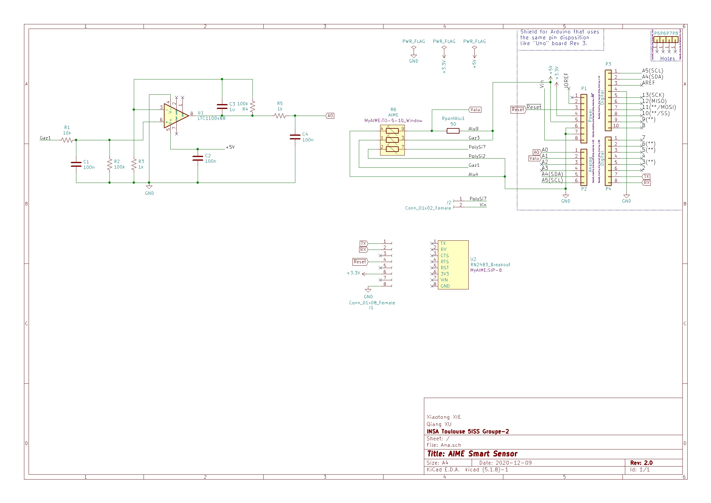

# 2020_2021- Qiang XU and Xiaotong XIE in 5ISS 

Our class in SMART DEVICES

Contact : [Qiang XU](qxu@etud.insa-toulouse.fr)
          [Xiaotong XIE](x_xie@etud.insa-toulouse.fr)

- [x] Introduction the measurement chain and smart devices
- [x] Internship at AIME
- [x] TPs relating to the design of an analog circuit to interface the gas sensor produced to the AIME
- [x] TP on Git and the GitHub platform
- [x] TP on microcontrollers and open source hardware
- [x] TP on the production of electronic cards under KiCad
- [ ] Complete the whole project
---

## 2020_2021 5ISS KiCad

### Arduino Project

### KiCad - Shield for Arduino

#### TODO Concevoir une carte avec KiCad

- [x] Create project
- [x] Try to make the initial connection
- [x] Design the circuit board
- [x] Create original AIME components
- [x] Import 3D models
- [x] Complete package
- [x] Complete circuit wiring
- [ ] Solve the problem that the circuit board cannot display normally
- [x] Practice using Github
- [ ] Use Github proficiently

#### KiCad Tools used

[KiCad EDA - Schematic Capture & PCB Design Software](https://kicad-pcb.org/), version: 5.1.8

Open source EDA / electronics CAD software for Windows, macOS and Linux.

[Find 3D mod as you want!](https://grabcad.com/library)

If you want, you can place a tractor or Trump model on the circuit board

[Library of kicad](https://gitlab.com/kicad/libraries)

#### Librairies de composants

* LED_THT:LED_D5.0mm
* Resistor_THT:R_Axial_DIN0207_L6.3mm_D2.5mm_P10.16mm_Horizontal
* MyAIME:SIP-8
* Capacitor_THT:C_Radial_D4.0mm_H5.0mm_P1.50mm
* Package_DIP:DIP-8_W7.62mm
* MyAIME:TO-5-10_Window

#### Electrical diagram

## Component placement

## Routage

